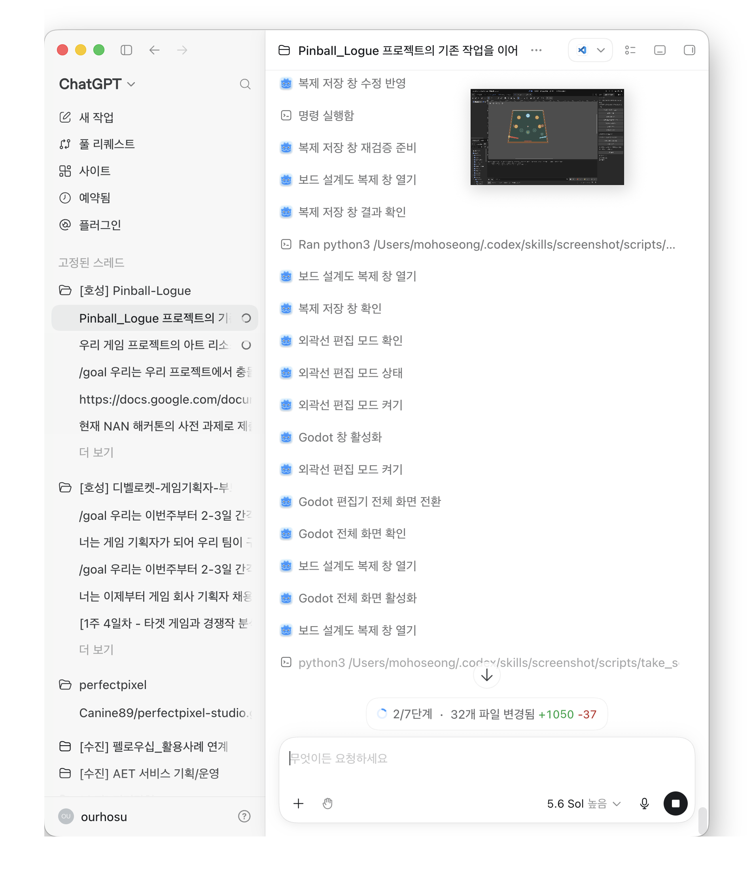

# 기획자용 보드 제작 가이드

## 먼저 알아둘 네 가지

- **보드 템플릿**은 보드 외곽선과 배치 지점의 위치를 저장한다.
- **배치 지점**은 비어 있을 수 있는 자리다. 자리를 움직여도 실제 오브젝트의 종류는 바뀌지 않는다.
- **오브젝트 원형**은 그 자리에 놓을 범퍼·벽·일반 오브젝트·유물 미리보기·플리퍼의 종류와 내구도를 저장한다.
- **웨이브 배치**는 어느 배치 지점에 어떤 오브젝트 원형을 놓을지 저장한다. 공은 플레이어가 게임 중 선택하므로 이 데이터에 넣지 않는다.

## 5분 빠른 시작

1. Godot 4.7.1에서 `stages/boards/board_authoring_2d.tscn`을 연다.
2. 씬 트리에서 `BoardAuthoring2D`를 선택하고 오른쪽의 **보드 제작 도구** 탭을 누른다.
3. **복제해서 새 보드 만들기**를 눌러 새 이름으로 저장한다. 기본 보드 파일은 직접 바꾸지 않는다.
4. **외곽선 편집**을 누르고 보드 모서리의 노란 점을 드래그한다.
5. 원하는 지점 추가 버튼을 누른다. 새 지점이 생기면 색상 점을 마우스로 옮긴다.
6. 지점을 선택하고 **선택 지점의 웨이브 배치**에서 오브젝트 원형을 고른 뒤 **선택 지점에 원형 적용**을 누른다.
7. `Cmd+S` 또는 `Ctrl+S`로 저장하고 F6으로 현재 제작 씬을 실행한다. 1280×720 창 중앙에서 같은 보드를 확인한다.

잘못 움직였으면 `Cmd+Z` 또는 `Ctrl+Z`로 실행 취소한다. 다시 적용하려면 `Cmd+Shift+Z` 또는 `Ctrl+Y`를 사용한다.

## 보드 외곽선 바꾸기

**외곽선 편집**을 누르면 모서리에 노란 손잡이가 표시된다. 손잡이를 드래그하면 보드 모양과 모든 2D 미리보기가 즉시 다시 그려진다. 외곽선이 서로 교차하거나 보드 범위를 벗어나면 변경을 적용하지 않고 한국어 오류를 보여 준다.

## 배치 지점과 실제 오브젝트를 따로 다루기

- **범퍼 지점 추가**: 범퍼 원형만 놓을 수 있는 자리다.
- **일반 오브젝트 지점 추가**: 벽 또는 일반 오브젝트 원형을 놓을 수 있다.
- **유물 배치 지점 추가**: 현재 단계에서는 유물의 보드 미리보기 자리다.
- **플리퍼 추가**: 보드 외곽선에 붙고, 드래그하면 외곽선을 따라 이동한다.

빈 지점은 옅은 표시만 보이며 실제 오브젝트가 생성되지 않는다. 원형을 적용하면 같은 자리에 실제 2D 디자인이 보인다. **배치 비우기**를 누르면 지점은 남고 오브젝트만 사라진다.

## 오브젝트 원형과 2D 디자인 바꾸기

기본 원형은 `pinball/objects`, `pinball/flippers`, `relics/catalog` 폴더의 `.tres` 파일이다. Godot 파일 시스템에서 원형을 복제한 뒤 인스펙터에서 다음을 설정한다.

- **Display Name**: 제작 도구에서 보이는 쉬운 이름
- **Object Type**: 범퍼, 벽, 일반 오브젝트, 플리퍼, 유물 미리보기 중 역할
- **Indestructible**: 파괴되지 않는지 여부
- **Max Durability**: 최대 내구도
- 범퍼 원형의 **Bumper Type**: Normal, Bounce, Track, Shot 중 범퍼 종류

현재 2D 모양은 `stages/boards/prefabs_2d`의 재사용 씬과 `default_board_presentation_catalog_2d.tres`가 연결한다. 같은 오브젝트 원형 ID에 다른 2D 씬을 연결하면 규칙 데이터는 그대로 두고 디자인만 바꿀 수 있다. 미래 3D 디자인도 같은 오브젝트 원형 ID를 사용한다.

## 플리퍼 1~4개 구성하기

플리퍼는 웨이브마다 실제 배치가 1~4개여야 한다. **플리퍼 추가** 후 손잡이를 드래그하면 가장 가까운 보드 외곽선을 따라 움직이며 보드 안쪽을 향한다. 다섯 번째 플리퍼는 도구가 거부한다. 표준 플리퍼와 소형 플리퍼 원형을 바꾸면 같은 지점에서 디자인이 교체된다.

## 어디서 결과를 확인하나

- 제작 중 확인: `stages/boards/board_authoring_2d.tscn`
- 현재 게임 보드 확인: `stages/boards/board_mockup_2d.tscn`
- 전체 흐름 확인: `app/bootstrap/app_root.tscn`을 실행하고 메인 로비에서 웨이브까지 진행

보드 제작 씬의 파란 원형 십자 표시는 **발사 지점**이지 공이 아니다. 공 선택·발사·충돌과 내구도 감소는 후속 4·6·8단계에서 동작한다.

## 자주 생기는 오류

- 원형 선택 목록이 비어 있음: 먼저 2D 화면의 배치 지점을 클릭한다.
- 원하는 원형이 안 보임: 지점 역할과 원형 역할이 맞는지 확인한다.
- 플리퍼를 비울 수 없음: 웨이브에 실제 플리퍼가 최소 1개 남아야 한다.
- 지점을 삭제할 수 없음: 먼저 **배치 비우기**로 실제 오브젝트 연결을 제거한다.
- 기본 파일을 바꿈: 저장하지 말고 닫은 뒤 기본 파일을 다시 열고, 다음부터 복제본에서 작업한다.
