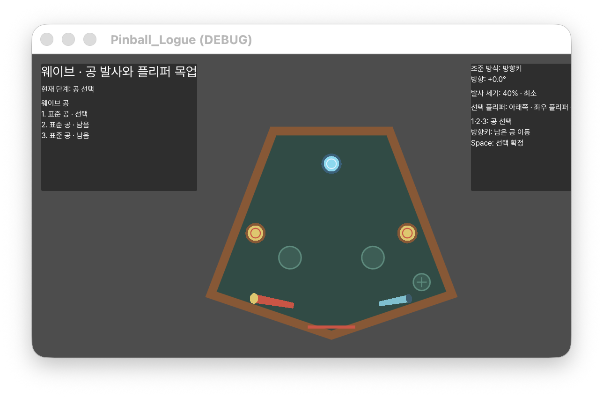
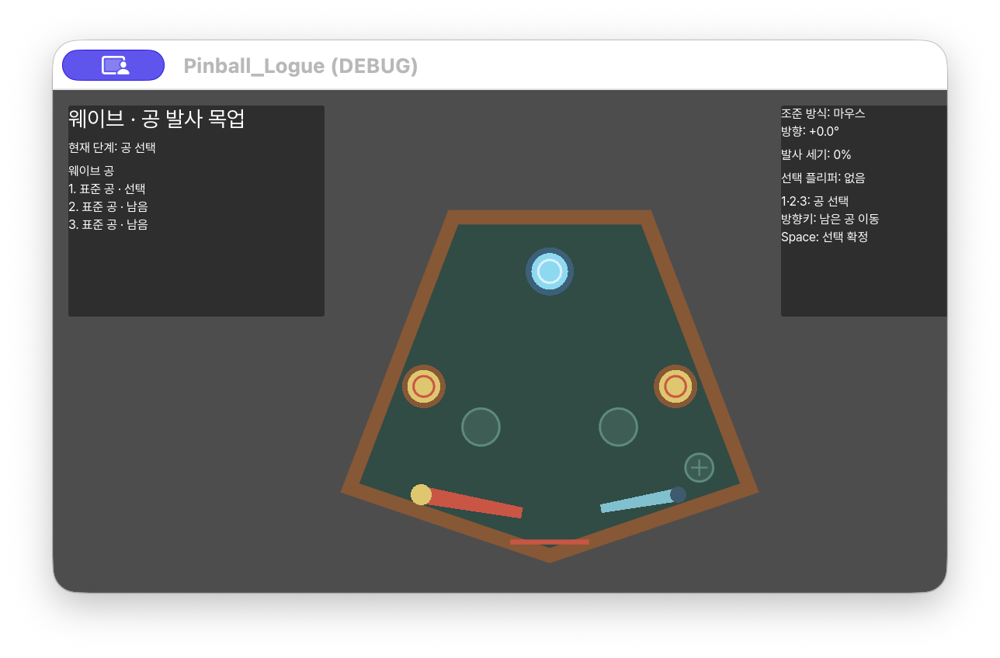
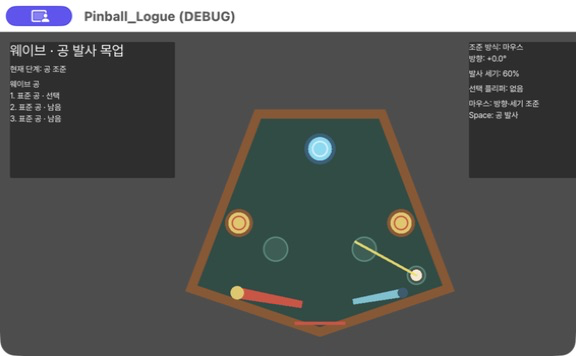
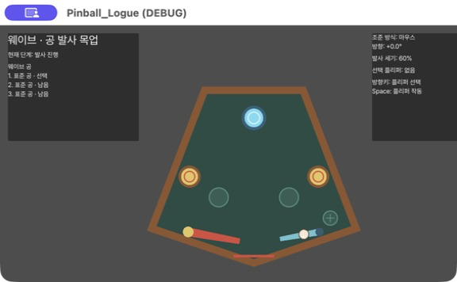
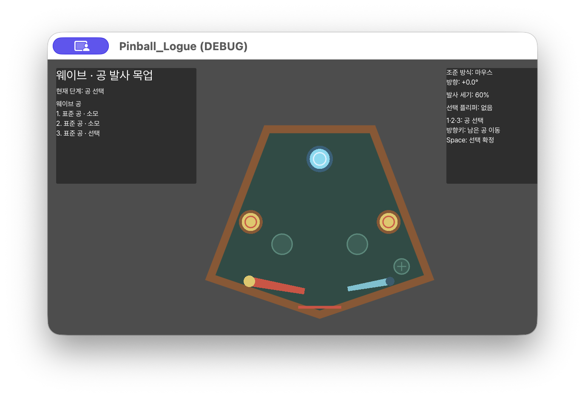

# 기획자용 보드 제작 가이드

## 먼저 알아둘 네 가지

- **보드 템플릿**은 보드 외곽선과 배치 지점의 위치를 저장한다.
- **배치 지점**은 비어 있을 수 있는 자리다. 자리를 움직여도 실제 오브젝트의 종류는 바뀌지 않는다.
- **오브젝트 원형**은 그 자리에 놓을 범퍼·벽·일반 오브젝트·유물 미리보기·플리퍼의 종류와 내구도를 저장한다.
- **웨이브 배치**는 어느 배치 지점에 어떤 오브젝트 원형을 놓을지 저장한다. 공은 플레이어가 게임 중 선택하므로 이 데이터에 넣지 않는다.


## 5분 빠른 시작

1. Godot 4.7.1에서 `stages/boards/board_authoring_2d.tscn`을 연다.
2. 씬 트리에서 `BoardAuthoring2D`를 선택하고 오른쪽의 **보드 제작 도구** 탭을 누른다.
3. **복제해서 새 보드 만들기**를 누르고 `forest_gate`처럼 영문 소문자·숫자·밑줄로 된 **보드 ID**를 입력한다. 기본 보드 파일은 직접 바꾸지 않는다.
4. **외곽선 편집**을 누르고 보드 모서리의 노란 점을 드래그한다.
5. 원하는 지점 추가 버튼을 누른다. 새 지점이 생기면 색상 점을 마우스로 옮긴다.
6. 지점을 선택하고 **선택 지점의 웨이브 배치**에서 오브젝트 원형을 고른 뒤 **선택 지점에 원형 적용**을 누른다.
7. `Cmd+S` 또는 `Ctrl+S`로 저장하고 F6으로 현재 제작 씬을 실행한다. 1280×720 창 중앙에서 같은 보드를 확인한다.

제작 도구에서 **웨이브에서 이 보드 시험**을 누르면 별도로 `wave_screen.tscn`의 인스펙터를 찾지 않아도 현재 보드와 웨이브 배치가 디버그 웨이브에 연결된다. 저장 후 `wave_screen.tscn`을 다시 실행하면 된다.

잘못 움직였으면 `Cmd+Z` 또는 `Ctrl+Z`로 실행 취소한다. 다시 적용하려면 `Cmd+Shift+Z` 또는 `Ctrl+Y`를 사용한다.

## 복제한 보드는 어디에 저장되나

보드 ID가 `forest_gate`라면 제작 도구가 다음 세 파일을 같은 보드 폴더에 자동으로 만든다. 제작자는 이 파일들을 따로 찾아 연결할 필요가 없다.

```text
res://stages/boards/content/forest_gate/
├── forest_gate_layout.tres
├── forest_gate_view.tres
└── forest_gate_wave_composition.tres
```

- `forest_gate_layout.tres`는 **보드 설계도**다. 외곽선과 배치 지점 위치를 저장한다.
- `forest_gate_view.tres`는 **보드 보기 설정**이다. 화면에서 보이는 보드 크기와 시점을 저장한다.
- `forest_gate_wave_composition.tres`는 **웨이브 배치표**다. 각 지점에 놓을 오브젝트 원형을 저장한다.
- 같은 보드 ID의 폴더나 파일이 이미 있으면 덮어쓰지 않고 새 ID를 요청한다.
- 예전에 다른 폴더에 만든 `.tres`는 자동으로 이동하지 않으며 기존처럼 계속 열어 편집할 수 있다.

`Cmd+Z` 또는 `Ctrl+Z`로 보드 복제를 실행 취소하면 현재 씬이 이전 설계도·보기 설정·배치표를 다시 가리킨다. 이미 만든 파일은 실수로 작업물을 잃지 않도록 삭제하지 않는다. 필요 없는 복제 파일을 실제로 삭제하는 일은 담당 작업자와 확인한 뒤 Godot 파일 시스템에서 별도로 처리한다.

## 인스펙터의 한국어 설정 이름

설정 파일 안에는 협업과 자동 검사를 위한 영문 속성명이 유지되지만 Godot 인스펙터에는 **보드 시점 각도**, **레일 두께**, **최대 내구도**처럼 기획 용어로 표시된다. 항목에 마우스를 올리면 쉬운 설명과 `px`, `°`, 보드 비율 같은 단위를 확인할 수 있다.

범퍼 종류처럼 내부 식별자가 영문인 선택값은 저장 호환성을 위해 임의로 번역해 저장하지 않는다. 제작 도구의 설명과 한국어 라벨을 기준으로 선택하며, 향후 개발자 모드에서도 같은 표시 정보를 사용한다.

## 보드 외곽선 바꾸기

**외곽선 편집**을 누르면 모서리에 노란 손잡이가 표시된다. 손잡이를 드래그하면 보드 모양과 모든 2D 미리보기가 즉시 다시 그려진다. 외곽선이 서로 교차하거나 보드 범위를 벗어나면 변경을 적용하지 않고 한국어 오류를 보여 준다.

## 배치 지점과 실제 오브젝트를 따로 다루기

- **범퍼 지점 추가**: 범퍼 원형만 놓을 수 있는 자리다.
- **일반 오브젝트 지점 추가**: 벽 또는 일반 오브젝트 원형을 놓을 수 있다.
- **유물 배치 지점 추가**: 현재 단계에서는 유물의 보드 미리보기 자리다.
- **플리퍼 추가**: 보드 외곽선에 붙고, 드래그하면 외곽선을 따라 이동한다.

빈 지점은 옅은 표시만 보이며 실제 오브젝트가 생성되지 않는다. 원형을 적용하면 같은 자리에 실제 2D 디자인이 보인다. **배치 비우기**를 누르면 지점은 남고 오브젝트만 사라진다.

## 오브젝트 원형과 2D 디자인 바꾸기

기본 원형은 `pinball/objects`, `pinball/flippers`, `relics/catalog` 폴더의 `.tres` 파일이다. Godot 파일 시스템에서 원형을 복제한 뒤 인스펙터에서 다음을 설정한다.

- **표시 이름**: 제작 도구에서 보이는 쉬운 이름
- **오브젝트 종류**: 범퍼, 벽, 일반 오브젝트, 플리퍼, 유물 미리보기 중 역할
- **파괴되지 않음**: 내구도가 줄어도 파괴되지 않는지 여부
- **최대 내구도**: 파괴 가능한 오브젝트가 버틸 수 있는 최대 기준
- 범퍼 원형의 **범퍼 종류**: Normal, Bounce, Track, Shot 중 범퍼 종류

6단계부터 범퍼 원형에는 다음 충돌 설정도 표시된다.

- **충돌 반지름**: 공이 범퍼에 닿는 실제 범위
- **타격당 내구도 감소**와 **최대 내구도**: 몇 번의 타격 뒤 파괴되는지 결정
- **파괴 후 복구**, **복구 대기 시간**, **복구 예고 시간**, **안전 복구 여백**
- 반동 범퍼의 **반동 속도 배율**
- 경로 범퍼의 **경로 이동 속도**
- 발사 범퍼의 **목표 발사 속도**와 **목표 방향 오차**

`기본 점수 근거`는 7단계 점수 시스템이 사용할 값이다. 현재 6단계에서는 타격 결과에 기록하지만 화면 스코어를 올리지는 않는다.

현재 2D 모양은 `stages/boards/prefabs_2d`의 재사용 씬과 `default_board_presentation_catalog_2d.tres`가 연결한다. 같은 오브젝트 원형 ID에 다른 2D 씬을 연결하면 규칙 데이터는 그대로 두고 디자인만 바꿀 수 있다. 미래 3D 디자인도 같은 오브젝트 원형 ID를 사용한다.

## 경로 범퍼와 발사 범퍼 만들기

경로와 발사 목표는 범퍼 원형 안에 좌표로 고정하지 않는다. 같은 범퍼 원형을 다른 보드에서도 재사용할 수 있도록 보드의 보조 지점으로 만든다.

1. `BoardAuthoring2D`를 선택하고 **보드 제작 → 범퍼 지점 추가**로 범퍼 자리를 만든다.
2. 해당 지점에 `경로 범퍼` 또는 `발사 범퍼` 원형을 적용한다.
3. 경로 범퍼라면 **보드 제작 → 경로 지점 추가**를 필요한 수만큼 누르고 파란 지점을 마우스로 옮긴다.
4. 발사 범퍼라면 **보드 제작 → 발사 목표 지점 추가**를 누르고 주황 지점을 마우스로 옮긴다.
5. 현재 보드의 `웨이브 배치표` `.tres`를 열고 해당 범퍼 배치 항목을 펼친다.
6. 경로 범퍼는 **경로 지점 순서**에 파란 지점 이름을 이동 순서대로 넣는다. 발사 범퍼는 **발사 목표 지점**에 주황 지점 이름 하나를 넣는다.
7. 제작 화면으로 돌아오면 경로는 파란 점선과 `경로 1·2…`, 발사 방향은 주황 선으로 확인할 수 있다.

범퍼를 다른 종류로 교체해도 제작 도구는 기존 경로·목표 연결을 보존한다. 새 종류에 불필요한 연결이 남으면 **오류 확인**에서 쉬운 한국어 오류가 나오므로 해당 웨이브 배치 항목에서 연결을 비운다.

## 플리퍼 1~4개 구성하기

플리퍼는 웨이브마다 실제 배치가 1~4개여야 한다. **플리퍼 추가** 후 손잡이를 드래그하면 가장 가까운 보드 외곽선을 따라 움직이며 보드 안쪽을 향한다. 다섯 번째 플리퍼는 도구가 거부한다. 표준 플리퍼와 소형 플리퍼 원형을 바꾸면 같은 지점에서 디자인이 교체된다.

- 보드 씬을 선택한 직후부터 `추가`를 누르지 않아도 기존 지점을 클릭하고 이동할 수 있다.
- 방향이 어긋난 플리퍼는 선택한 뒤 **선택 플리퍼 안쪽 방향 맞춤**을 누른다.
- 의도적으로 기울이려면 **왼쪽으로 15°** 또는 **오른쪽으로 15°**를 누른다. 각도는 보드 안쪽 방향을 기준으로 적용된다.
- 보드가 작게 보이면 **보드 표시 15% 크게**, 너무 크면 **보드 표시 15% 작게**를 사용한다. 공용 기본 보기 설정은 보호되므로 먼저 **복제해서 새 보드 만들기**를 실행해야 한다.
- 경로 범퍼와 발사 범퍼를 적용하면 필요한 첫 경로 지점 또는 발사 목표 지점이 자동으로 생긴다. 생성된 파란색·주황색 지점을 마우스로 원하는 위치에 옮긴다.

## 어디서 결과를 확인하나

- 제작 중 확인: `stages/boards/board_authoring_2d.tscn`
- 현재 게임 보드 확인: `stages/boards/board_mockup_2d.tscn`
- 공 선택·조준·발사 확인: `app/navigation/screens/wave_screen.tscn`
- 전체 흐름 확인: `app/bootstrap/app_root.tscn`을 실행하고 메인 로비에서 웨이브까지 진행

보드 제작 씬의 파란 원형 십자 표시는 **발사 지점**이지 공이 아니다. 공은 웨이브에 가져갈 공 목록에서 선택해 이 지점에 만들어진다. 실제 범퍼 충돌과 내구도 감소는 `app/navigation/screens/wave_screen.tscn` 또는 전체 게임 실행에서 확인한다.



## 웨이브 공 1~3개와 조준 방식을 바꾸는 방법

기본 파일을 직접 수정하지 말고 Godot 파일 시스템에서 다음 두 파일을 복제한다.

- `stages/waves/default_mockup_ball_loadout.tres`: 웨이브에 가져갈 공 목록
- `pinball/launcher/default_launch_config.tres`: 조준 방식과 발사 세기

웨이브 ID가 `forest_gate_wave_1`이라면 복제본은 다음 규칙을 권장한다.

```text
res://stages/waves/content/forest_gate_wave_1/
├── forest_gate_wave_1_ball_loadout.tres
└── forest_gate_wave_1_launch_config.tres
```

1. **웨이브 공 목록** 복제본을 열고 **웨이브 공 목록**의 크기를 1~3으로 정한다.
2. 각 칸의 **공 슬롯 이름**은 `ball_slot_1`처럼 서로 다르게 적는다.
3. 각 칸의 **공 원형**에는 이미 만든 공 `.tres`를 넣는다. 기본값은 `pinball/ball/standard_ball_definition.tres`의 **표준 공**이다.
4. **발사 설정** 복제본을 열고 **조준 방식**을 `mouse` 또는 `direction_keys`로 고른다.
5. `wave_screen.tscn`을 열고 씬 트리의 `WaveScreen`을 선택한다.
6. 인스펙터의 **웨이브 공 목록**과 **발사 설정**에 방금 만든 두 복제본을 끌어다 놓는다.
7. F6으로 현재 씬을 실행한다. 공 선택 상태에서 `1`·`2`·`3` 또는 방향키로 남은 공을 고르고 `Space`로 확정한다.

`mouse`는 마우스 위치로 방향과 세기를 함께 조절하고 `Space`로 발사한다. `direction_keys`는 `←`·`→`로 방향, `↑`·`↓`로 세기를 조절하고 `Space`로 발사한다. 방향키를 짧게 누르면 한 단계, 길게 누르면 같은 방향으로 계속 조절된다. 조준 방식을 실행 중에 바꾸면 현재 공이 아니라 다음 공의 조준부터 적용된다.









공이 진행 중일 때 방향키는 보드 위 상대 위치에 따라 배정된 플리퍼를 고르고 `Space`는 플리퍼 작동 요청으로 바뀐다. 실제 플리퍼 움직임과 공 패링은 5단계에서 연결한다. 세 공을 모두 사용하면 4단계 목업은 멈추며, 목표 스코어와 웨이브 성공·실패 판정은 7단계에서 연결한다.

## 자주 생기는 오류

- 원형 선택 목록이 비어 있음: 먼저 2D 화면의 배치 지점을 클릭한다.
- 원하는 원형이 안 보임: 지점 역할과 원형 역할이 맞는지 확인한다.
- 플리퍼를 비울 수 없음: 웨이브에 실제 플리퍼가 최소 1개 남아야 한다.
- 지점을 삭제할 수 없음: 먼저 **배치 비우기**로 실제 오브젝트 연결을 제거한다.
- 기본 파일을 바꿈: 저장하지 말고 닫은 뒤 기본 파일을 다시 열고, 다음부터 복제본에서 작업한다.
